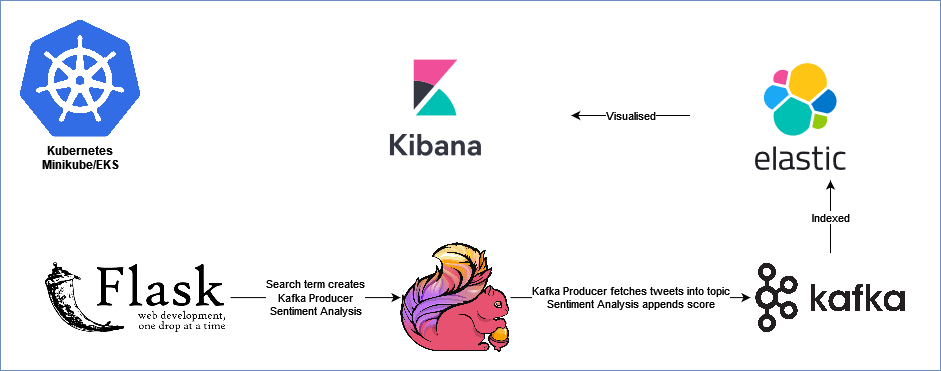

# scalable-streaming-data-platform

A Data Engineering platform using streaming technologies to run both locally and easily scale up to cloud.

## Intro
#### Aims
* Use readily available real-time data streams
    * Tweets
    * Air quality
    * Weather
    * Traffic
* Ingest into Kafka as a message bus
* Perform real-time processing using Flink
* Provide a scalable platform to enable analysis, prediction
* Be technology agnostic, allowing different languages/technologies to be integrated through a decoupled pub/sub architecture

#### Example use cases:
* Perform sentiment analysis on tweets
* Visualise data in real time on a map
* Aggregate sentiments relating to keywords and look at trends with their local environment
* Links to COVID
    * Track lockdown through traffic, how weather effects adherence to lockdown
    * Track air quality due to lockdown (more historical)
    
 

## Setup

### Credentials
Populate the credentials directory with twitter.properties containing the following credentials for API use:
 twitter-source.token=
 twitter-source.tokenSecret=
 twitter-source.consumerKey=
 twitter-source.consumerSecret=

Once you have deployed elasticsearch, you will also need to populate
 elasticsearch_password.txt
 kibana_password.txt
 test_password.txt (choose a password for your test user)
 using the following command from a shell on the container running elasticsearch
 `bin/elasticsearch-setup-passwords auto`
 The kibana password must also be copied to the kibana-deployment.yaml 

To generate an elasticsearch certificate for XPACK security go to the 'bin' directory in a shell on the container running elasticsearch
 Execute command `./elasticsearch-certutil ca`
 This will generate a certificate authority in your elasticsearch main directory.
 When you are asked to enter a filename for your CA, hit "enter" then it'll take the default filename 'elastic-stack-ca.p12'.
 Then after it'll ask for a password for the CA(Certificate Authority), then again hit "enter".
 Now we need to generate a TLS certificate for your elasticsearch instance using above generated CA file.
 For that, execute `./elasticsearch-certutil cert --ca elastic-stack-ca.p12`.
 When executing this command first, it'll ask for the password of your CA file, then hit 'enter'.
 After it will ask for TLS certificate name then again hit 'enter' then it'll take the TLS certificate name as 'elastic-certificates.p12'
 which is the default name finally it'll ask for a password for the TLS certificate, then again hit 'enter'.
 Copy 'elastic-certificates.p12' to the credentials folder in the repo

 

### Docker

1. With Docker Toolbox installed, create a docker machine locally by running  `./scripts/create-docker-machine.sh`

2. Start your docker machine and spin up Kafka and Zookeeper  `./scripts/start-docker-machine.sh`

3. Can run producers and consumers locally to communicate with the docker machine via DOCKER_MACHINE_IP, which must be exported in your environment  `export DOCKER_MACHINE_IP=$(docker-machine ip development)`

4. Build scala applications using Maven with  `mvn clean package`

5. Run flink jars using  `flink run -m ${DOCKER_MACHINE_IP}:8081 target/scalable-streaming-data-platform-1.0-SNAPSHOT-jar-with-dependencies.jar`

6. Create elasticsearch users and passwords using `docker-compose exec elasticsearch bash` followed by `bin/elasticsearch-setup-passwords auto`

 

### Kubernetes:
#### Minikube
Start minikube locally
 `minikube start --no-vtx-check --memory 8192 --cpus 4 --mount 
--mount-string="<path_to_repo_root>/credentials:/usr/share/elasticsearch"`
 Open Kubernetes dashboard in browser
 `minikube dashboard`
  In GitBash/Unix shell (not Intellij integrated terminal)
 `eval $(minikube docker-env)`
  then from repository root
 `docker build -t kafka-connect .`

To build flask docker image
 `cd flask/app`
 `docker build -f Dockerfile -t flask:latest .`
 `minikube image load flask:latest`

To deploy kubernetes apps to minikube cluster
 `kubectl apply -f kubernetes --recursive`
To take down the services run
 `kubectl delete -f kubernetes --recursive`
To open a service in your browser run
 `minikube service --url <service-name>`

 Then run `./scripts/kube/curl-kafka-connect-minikube.sh`

You can build jars for flink jobs then upload through the flink dashboard.
 `./build-jars.sh`
 `minikube service --url jobmanager`
 Upload kafka-producer-twitter.jar from target folder

To view messages on Kafka directly, open a shell on kafka pod
 `cd /`
 `bin/kafka-console-consumer --topic tweets --bootstrap-server kafka:9092`
 To see how many messages in each topic
 `bin/kafka-run-class kafka.admin.ConsumerGroupCommand --group flink --bootstrap-server kafka:9092 --describe`

 

#### EKS
To deploy to AWS:
 `eksctl create cluster --name=twitter-streaming`
To destroy EKS cluster:
 `eksctl delete cluster --name=twitter-streaming`

To deploy Kubernetes dashboard
 `kubectl apply -f kubernetes/aws --recursive`
 `kubectl -n kube-system describe secret $(kubectl -n kube-system get secret | grep eks-admin | awk '{print $1}')`
 `kubectl proxy`
  Open in browser and paste the auth token from kube-system above
 `http://localhost:8001/api/v1/namespaces/kubernetes-dashboard/services/https:kubernetes-dashboard:/proxy/#!/login`

To deploy app to EKS:
 `kubectl apply -f kubernetes/eks --recursive`

To access UI of pods:
Flink
 `http://localhost:8001/api/v1/namespaces/default/services/jobmanager:8081/proxy/`
Flask
 `kubectl port-forward service/flask 8050:8000`
Then go to
 `http://localhost:8050`
Kibana
 `kubectl port-forward service/kibana 5050:5601`
Then go to
 `http://localhost:5050`

 Then run 
 `cd scripts/kube`
 `./curl-kafka-connect-eks.sh`

To deploy images to ECR:
 `export AWS_REGION=eu-west-1
     export AWS_USER=<user>
     export ECR_REPO=twitter-streaming`
 `aws ecr get-login-password --region $AWS_REGION | docker login --username AWS --password-stdin $AWS_USER.dkr.ecr.$AWS_REGION.amazonaws.com`
 `docker tag kafka-connect:latest $AWS_USER.dkr.ecr.$AWS_REGION.amazonaws.com/$ECR_REPO:kafka-connect`
 `docker tag flask:latest $AWS_USER.dkr.ecr.$AWS_REGION.amazonaws.com/$ECR_REPO:flask`
 `docker push $AWS_USER.dkr.ecr.$AWS_REGION.amazonaws.com/$ECR_REPO:kafka-connect`
 `docker push $AWS_USER.dkr.ecr.$AWS_REGION.amazonaws.com/$ECR_REPO:flask`

Store the elastic-certificates.p12 in S3
e.g. `s3://scalable-streaming-data-platform-eks`
 

 

 Maven Version 3.6.3
 Java Version 1.8.0_202
 Flink Version 1.11.2